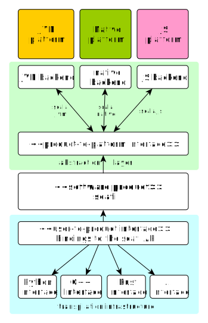

# Master thesis notes

This document is a live document tracking the progress and development of my master thesis project that will be updated as the project evolves.

## Goals

**Problem Statement**: Scafi is a programming model for aggregate computing that enables writing distributed programs in a high-level, declarative manner, based on _field calculus_. The Scafi library is implemented in Scala and designed for the JVM platform.
Alternative implementations have been developed in languages like C++, Kotlin, and Rust to address performance needs or support different platforms, such as embedded or mobile devices. However, these implementations have been created independently from scratch, with no code reuse, and no compatibility in mind.

The **goal** of the thesis is to re-engineer scafi architecture to achieve multi-platform and multi-language independence.

More in details, the thesis aims to:

- define an extensible architecture for scafi allowing to target heterogeneous devices, both JVM-based and native, and to support web and non-web environments;
- nimbly support the development of Scafi programs in various languages, such as (but not limited to) C++, Python, Kotlin, and Rust.

In the end the contribution of this thesis should enable the aggregate programming community to effortlessly use Scafi in diverse computational environments and with different programming languages

## Requirements

-- Requirements are still incomplete and need to be refined --

### Functional requirements

#### User requirements

1. The library client should be able to write Scafi programs in different supported languages through a consistent API. Supported languages must include:
    - _TBD_
2. The library client should be able to target different platforms, including:
    - JVM-based platforms;
    - native platforms;
    - web platforms.
3. For JVM the library should ensure compatibility with the existing Scafi library.

#### System requirements

1. The core aggregate computing abstractions and API implementation should be shared across all supported languages and platforms.
2. The system should provide the ability to target different platforms through a consistent user-side API for each supported language.
3. The infrastructure should provide a mechanism to automatically generate user-side API bindings for each supported language so that any change can be automatically propagated without manual intervention.
4. Programs written in different languages should exhibit equivalent behavior, regardless of the platform.

### Non-functional requirements

1. Performance: _TBD_
2. Extensibility: the architecture should allow for easy addition of new language bindings and platform-specific optimizations / logic.
    - _TBD what is meant by "easy"_
3. Reliability: the architecture should ensure robustness in program execution across platforms with clear error reporting.
4. The user-side API should be idiomatic to the target language, providing a seamless experience for the library client.

## Coarse grained architecture

The architecture follows the Basilisk architectural pattern [^1] which aims to establish clear boundaries to decouple software products from both the underlying platforms and user-end programming languages.

Highlights:

- the abstraction layer leverages scala multi-platform compiler capabilities, targeting JVM, Javascript and Native platforms.
  - the _product-to-platform_ interface is a contract defining the platform-specific functionalities, which are appropriately implemented in each supported backend according to the target platform.
- the transpilation infrastructure allow to generate a consistent user-side facade over the scafi API, tailored to the specific target language of choice (similarly to the approach described in [^1]).
  - important: the _user-to-product_ interface contains only the bindings to access the software product, implemented using a _foreign function interface_ (FFI) library for the specific targeted language.
    - for example, when targeting the native platform the transpilation infrastructure must be able to generate bindings through the C ABI using ad-hoc FFI libraries (e.g. [`swig`](https://www.swig.org/)).

Challenges to address:

- shared code must use only _cross-platform_ libraries and features;
  - currently scafi `spala` module leverages Akka actors, which is not _cross-platform_;
- for native and web platforms crafting a facade over the scafi API that can be called from another language using a FFI is not trivial;
- some specific language adapter may be required to better fit the target language idioms and conventions.

## Work plan

The initial work plan is to start with a proof of concept to validate the architecture.

1. implementation of a simple DSL inspired to the _Sapere_ incarnation using scala multi-platform;
2. creation of a native interoperable layer over the DSL that make it possible to call it using FFI libraries in other programming languages;
3. creation of a minimal transpilation infrastructure inspired to Hydra[^1] for some language of choice, initially for a small set of languages;
4. add distribution / creation of a JS interoperable layer;

[^1] https://www.sciencedirect.com/science/article/pii/S016412122400133X?via%3Dihub
